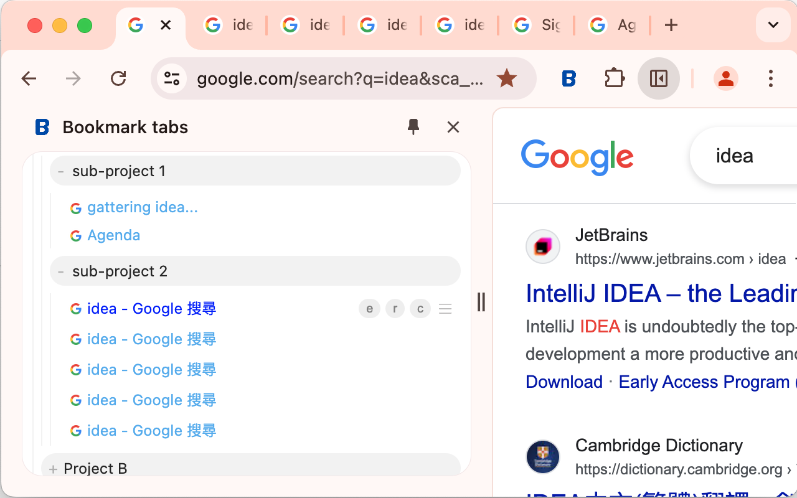

- This extension is inspired by Arc browser. I love the way how it integrates bookmarks and tabs together, but dislike almost all the other ideas. Especially those AI craps.
- So here comes the very early first version of "Bookmark tabs" extension.
- It's not just a vertical bookmark, when you click a bookmark, it associated with the opened tab, so you can switch the tab by click the bookmark again.
- It's simple but after a few days of daily usage by myself, I'll say it's comprehensive enough.
- 
- DOCUMENTATION
	- Extension Icon
		- Click it to open this extension in sidepanel
		- It's recommended to change the sidepanel position to left side in [chrome://settings/appearance](chrome://settings/appearance)
		- Q&A
			- The sidepanel is too wide, how can I narrow it down?
				- No you can't, them minimum width is limited by chrome the browser itself. I believe google will make it smaller in the future version. But for now we have to live with it.
	- Folder
		- Click it to expend/unexpend the folder
		- When your cursor hovering above a folder, there'll be some buttons appear in the right side.
			- e
				- [e]dit this folder's name
			- m
			  id:: 66910935-c294-43fd-bc33-080bfd9acec3
				- [m]ark current tab in this folder
			- f
				- add nested [f]older
			- r
				- [r]emove this folder
			- hamburger button
				- drag&drop to reorder it
	- Bookmark
		- Click it to open a tab associated with it
		- When your cursor hovering above a bookmark, there'll be some buttons appear in the right side.
			- e
				- [e]dit this bookmark's name
			- r
				- [r]emove this bookmark
			- c (only appear when it has a associated tab)
				- [c]lose the associated tab
			- hamburger button
				- drag&drop to reorder it
		- It's title can have three colors
			- black
				- has no associated tab
			- light blue
				- has associated tab opened, but not current one
			- blue
				- the current tab is it associated tab
		- If you change the url of a bookmark's associated tab, the url of  tab and bookmark will not be in sync.
			- There'll be a "*" in front of the title of the bookmark.
			- Click the "*" will sync the url of the bookmark to be identical with the tab.
			- If you're fine to lose the changes of the tab url, just ignore the "*".
			- Or you can [((66910935-c294-43fd-bc33-080bfd9acec3))]ark this tab again, it'll produce a new bookmark associated with this tab, the previous bookmark is stay untouched.