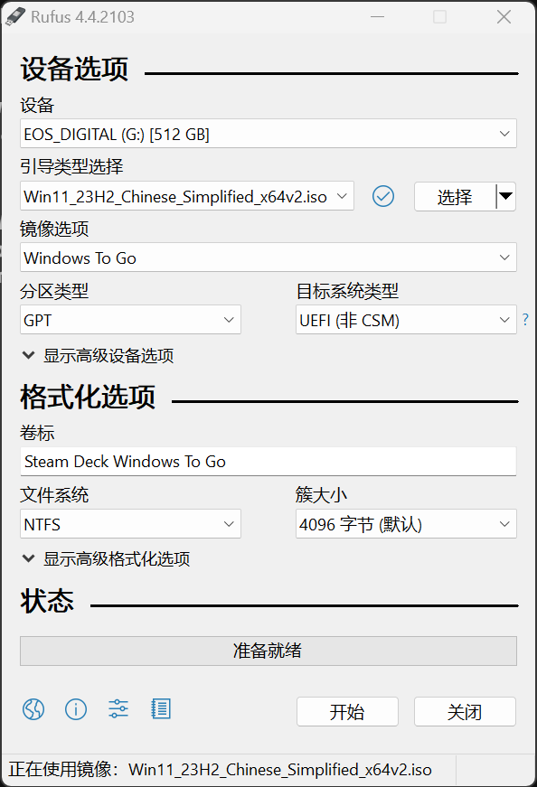
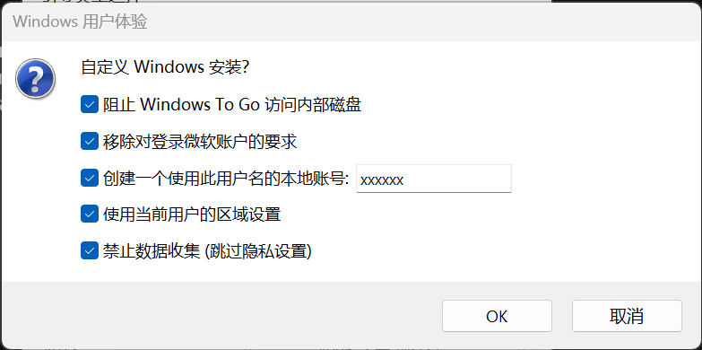

# 安装 windows
- 来源
	- https://www.xda-developers.com/how-install-windows-steam-deck/
	- 基本是无废话版翻译这篇文章
- 下载 [windows 11 镜像](https://www.microsoft.com/zh-tw/software-download/windows11)
- 下载 [rufus](https://rufus.ie/en/)
- 下载 [steamdeck windows 驱动](https://help.steampowered.com/en/faqs/view/6121-ECCD-D643-BAA8)
	- ==注意区分 OLED 和 LCD 版本==
- 打开 rufus，选中 SD 卡，选中镜像，镜像选项选择“Windows To Go”，点击开始
	- ==注意 SD 卡中所有内容会被清空，确保已经备份了有用的资料==
	- （可选）修改卷标，没啥用就是了
	- {:height 412, :width 274}
- 修改弹出窗口中的选项，点击 OK
	- 视情况选择即可，可以参考我下面的选项
	- {:height 221, :width 423}
- rufus 需要一点点时间，这期间可以整理一下驱动程序，全部解压放到一个文件夹中。
- rufus 进度条走完了，复制刚才解压的驱动到 sd 卡中，弹出 sd 卡，插到 steamdeck 中
- steamdeck 关机，然后按住“音量减+电源”，直到屏幕显示 steamdeck logo
- 稍作等待，在后续的界面中选择从刚才的 sd 卡启动。
- 屏幕是侧向显示的，不用担心一切正常。~~，毕竟是冰箱屏幕清库存~~
- 按照提示操作完成 windows 初始配置
	- 如果触屏无效，搞个 usb 扩展坞插键鼠操作即可
	- ==建议跳过 WiFi==，离线完成配置。在安装好驱动前，WiFi 速度慢的离谱。
		- 如果用了扩展坞，可以插有线网络
- 到了桌面后，进入设置 -> 显示 -> 方向改为“水平”
- 文件管理器打开 SD 卡，打开装有驱动的文件夹，依次安装驱动
	- APU
		- 运行 `setup.exe`
	- Wi-Fi
		- 运行 `installer.bat`
	- Bluetooth
		- 运行 `installdriver.cmd`
	- SD card reader
		- 运行 `setup.exe`
	- Audio one
		- 右键单击 `cs35l41.inf`，选择 `安装`
	- Audio two
		- 右键单击 `NAU88L21.inf`，选择 `安装`
- 安装结束
- # 必要软件
- https://glossi.flatspot.pictures/#downloads