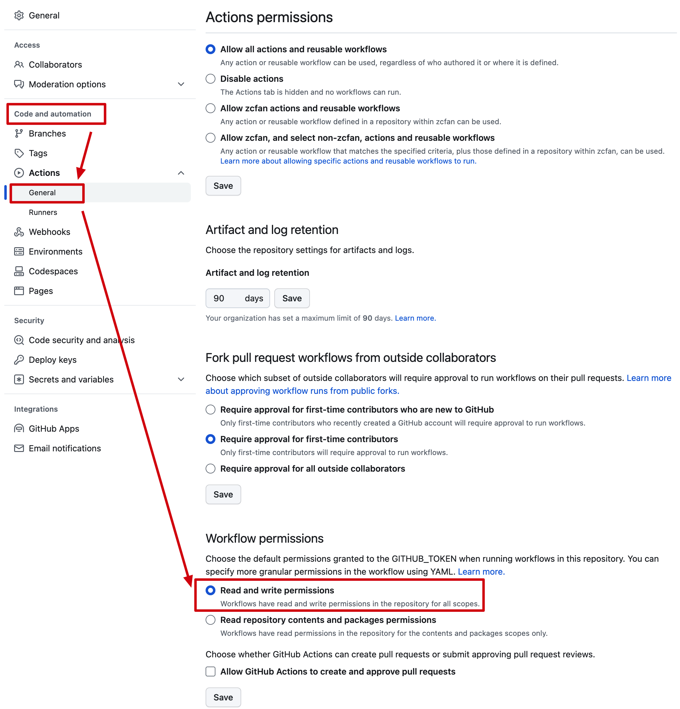

tags:: 文章, TIL
created:: [[Apr 10th, 2023]]

- 目的
	- 零成本（或极少成本）建设一个类似[本站（https://www.alanslab.today）](https://www.alanslab.today)的博客
- 材料
	- [Github Page](https://docs.github.com/en/pages/quickstart)
		- 用于免费提供静态网站
		- （可选）另外购买域名，跟随 Page 文档指导配置自定义域名
	- [Logseq](https://logseq.com/)
		- 平时用于个人知识管理，这里用于写作
	- [pengx17/logseq-publish](https://github.com/pengx17/logseq-publish)
	  id:: 64336706-c37c-4e57-8dc5-48985bba5c9d
		- 用于自动将 Logseq 博客图谱发布到 Github Page
- 建议
	- 配置教程
		- 参考 ((64336706-c37c-4e57-8dc5-48985bba5c9d)) 中的视频教程完成配置
	- workflow 提示没有权限
		- 去仓库 Settings 中配置 workflow 权限
			- {:height 593, :width 563}
	- 如何发布
		- add & commit & push Logseq 图谱仓库
		  id:: 643368bc-4d9b-4574-8c5a-3ab60a031cf5
		- ```
		  git add . && git commit -m "auto publish" && git push
		  ```
	- 如何简化发布
		- Logseq 设置中有自动 commit 的功能，但并不好用
		- 建议编写脚本自动化 ((643368bc-4d9b-4574-8c5a-3ab60a031cf5))
		- （可选）辅以 [[Raycast]] 这类工具的自定义脚本功能，写完了一键发布会更方便
	- 大陆访问？
		- 随缘吧，没能力翻墙的应该也没必要看这些东西
		- 大陆其他 Github 竞品有类似 Page、Action 服务的话，应该也可以套用这套流程