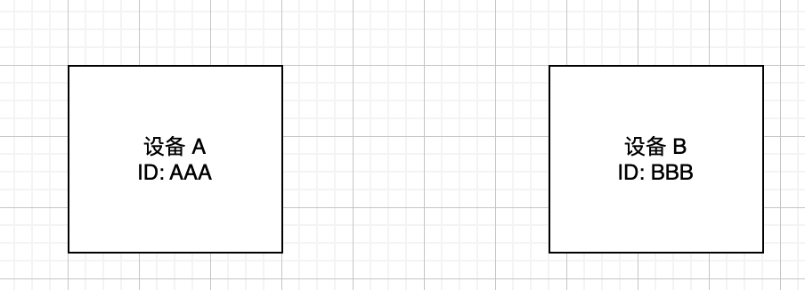
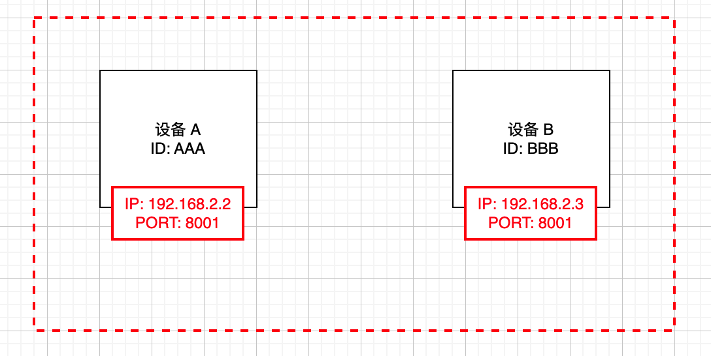
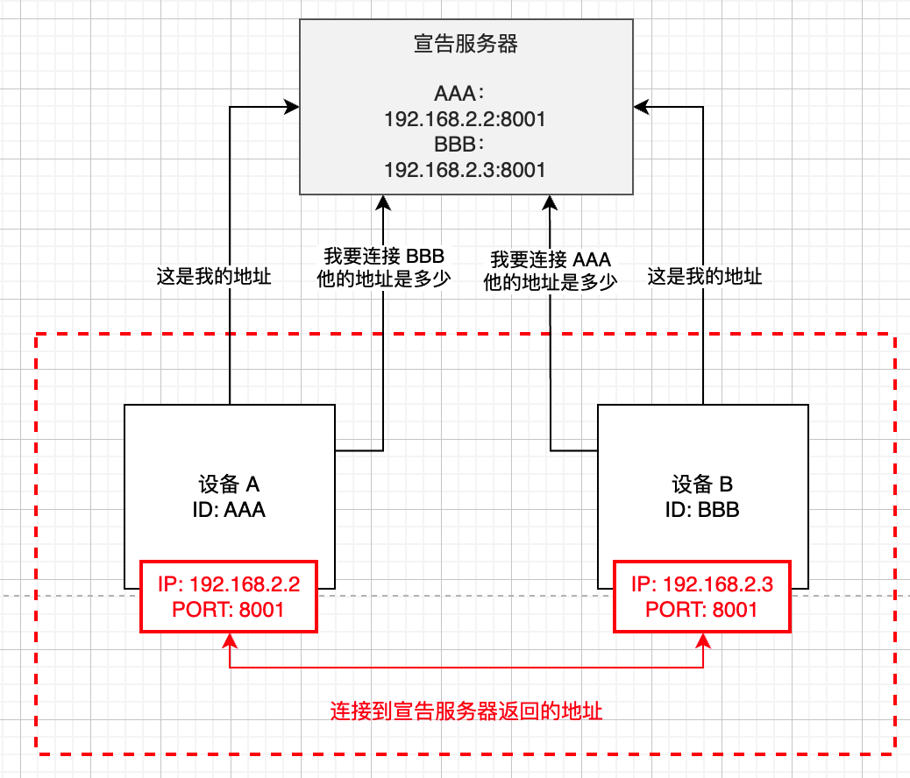
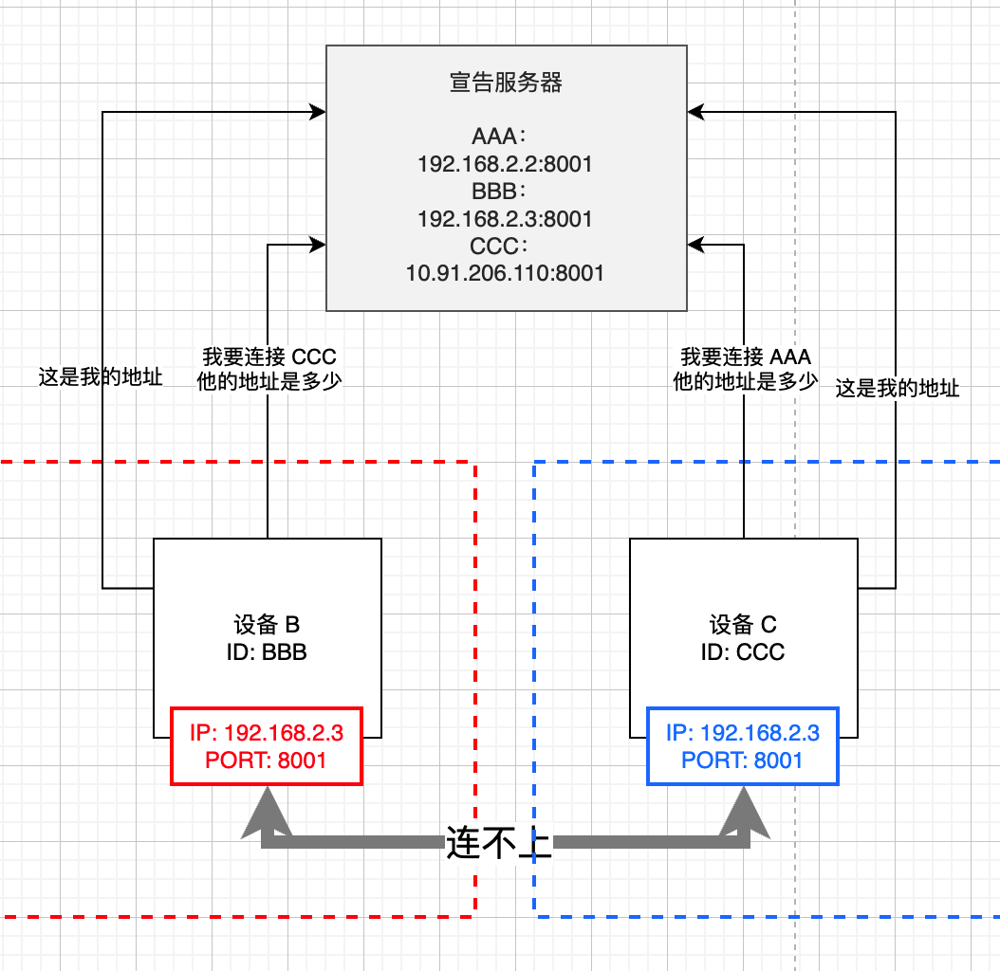
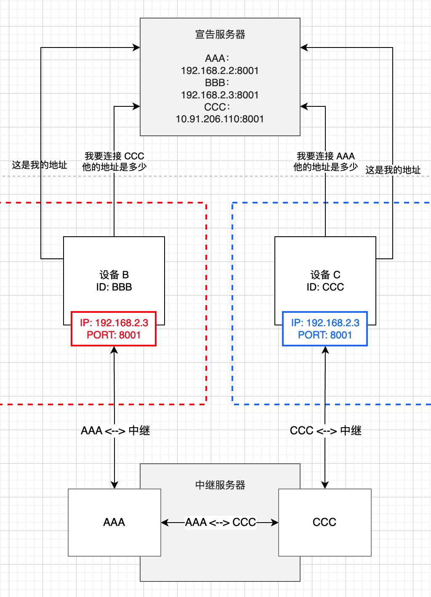

- [[Jan 28th, 2024]] 更新：
	- > 最近没忍住买了极空间的 NAS，本想替换掉 syncthing 结果它不支持 android 上的双向同步。。。
	  但不甘心花了钱还要用 syncthing 这种去中心的方案，所以过阵子应该会再折腾一下同步盘。。。
- 因为最近换了 android 机，所以好久之前就关注的 syncthing 就派上用场了。
- syncthing 是一个开源的 P2P 同步盘方案，我总结下特点有
	- 免费
	- 去中心
	- 自带内网穿透能力
	- 快！
- 可以说是把 iCloud 给秒没边了，缺点也有：
	- 没有 ios 客户端
	- 使用中继时，速度较慢，你的数据的元信息能被中继看到
	- 用起来没那么傻瓜（但也很傻瓜了，只要你稍微花点心思，了解一下它的模型）
	- 比起商业服务，文件丢失的风险还是比较大。
		- 比如所有同步了的设备一起挂逼，听起来有点离谱，但绝对比商业服务挂逼的概率大。
		- 比如某天上班路上手机丢了，到了公司发现电脑硬盘坏了，凉凉
		- 比如某天手机和笔记本一起装包里丢了/掉路上被卡车压碎了/被熊孩子的篮球砸爆
- 原理介绍
	- 有几个重要的概念，了解了之后基本使用就没问题了：
		- 设备 ID
		- 协议监听地址
		- 宣告服务器
		- 中继服务器
	- 设备 ID
		- 新安装 Syncthing 时会生成一个唯一 ID，就是这个设备的设备 ID
		- {:height 156, :width 380}
	- 协议监听地址
		- 本机监听的地址，允许其他 Syncthing 设备连接自己
		- 比如下图中，两台设备都在监听 8001 但它们并不知道对方的存在
		- {:height 229, :width 407}
	- 宣告服务器
		- 可以看到每台设备都可以自己指定随便哪个端口，两台设备要发现对方，需要用到宣告服务器
		- syncthing 有公共的宣告服务器，所以自用的时候不用自己搭建
		- 不用担心自己的 ID 在宣告服务器搭建，因为两个设备连接是需要双方确认的，你完全可以忽略所有未知设备的连接尝试。
		- {:height 408, :width 455}
		- 如果是完全内网的环境，连不上公共的宣告服务器，可以考虑[自建宣告服务器](https://docs.syncthing.net/v1.23.3/users/stdiscosrv.html)
	- 中继服务器
		- 存在两个设备无法直接连接的情况，比如一个在公网，一个在内网，且没有配置 DMZ 主机等设置。
		- 如图，两个处于不同网络的设备尽管通过宣告服务器得知了对方监听的地址，但却无法直接建立连接。
		- {:height 492, :width 459}
		- 此时可以用上中继服务器
		- 只要两个设备都能访问中继服务器，就能分别与中继服务器建立链接，由中继服务器代为转发消息，建立两个设备之间的连接。
		- {:height 626, :width 433}
		- 同样的中继服务器也有公共的，只要你要同步的内容不敏感，就可以使用。但问题是速度较慢。。。可以理解，流量也是要钱的，人家用爱发电没法要求更多。
		- 所以如果有这种需求，可以考虑[自建中继服务器](https://docs.syncthing.net/v1.23.3/users/strelaysrv.html)。
		- 注意一点中继服务器默认是会加入公共池的，也就是说你的中继服务器会被其他人所使用，只要他们能连上。所以如果是要私用务必按文档配置。
- 原理的介绍就结束了，剩下的都是应用层的各种功能，但也很有特色。比如给指定设备共享指定文件夹，比如排除特定模式的文件不共享。可以自己慢慢摸索。
- 目前已知的问题
	- 同步 Logseq 时，如果你也同时在编辑，会产生大量冲突文件，但实际上文件内容并没有冲突。已经有一些 issue 在讨论这个情况，问题可能出在 logseq 这边，考虑是文件元信息中修改日期被错误更新了，暂时还没解决。
		- 更新：后面自己好了，可能是特殊情况下偶现的问题，但我后面确实没有遇到了。
	- 没了，同步些日常文档什么的爽的一批