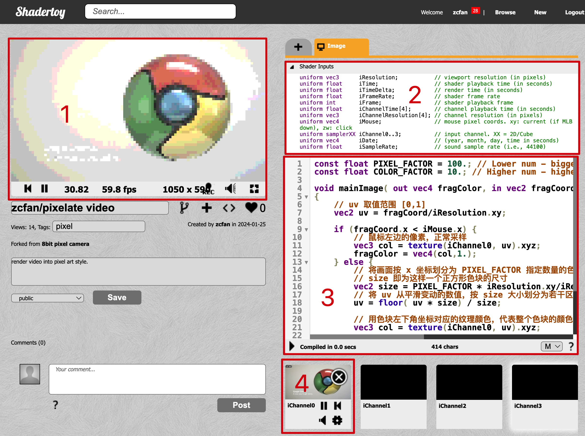
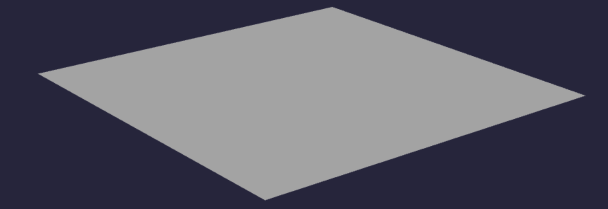
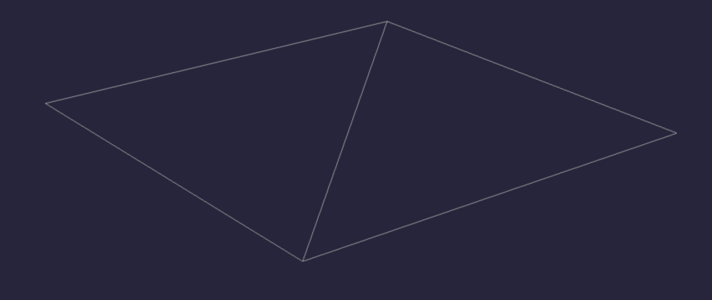
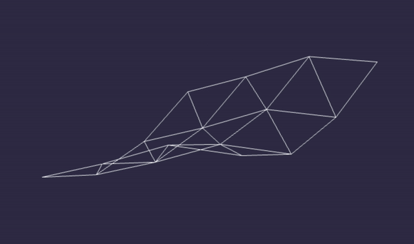
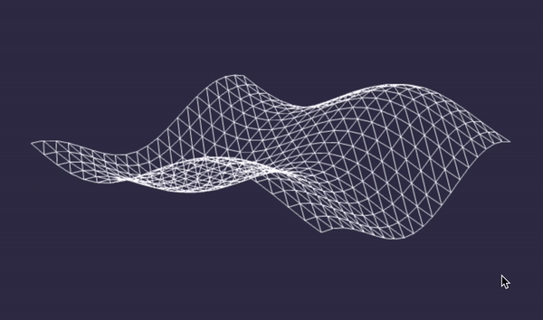

- > 周会分享内容，整理一下水一篇
- 这篇文章中我们通过几个 demo 对 shader 有个直观的了解。
- # demo 预览
- ## demo1：vertex 以及 vertex shader（顶点着色器）
- 
- https://github.com/zcfan/babylonjs-demo-shader-material
- ## demo2：fragment shader（片元着色器） 以及凸球效果（瞎起的名字）
- 
- [https://www.shadertoy.com/view/McBXzm](https://www.shadertoy.com/view/McBXzm)
- ## demo3：还是 fragment shader，像素风着色器
- 
- [https://www.shadertoy.com/view/lcBXzm](https://www.shadertoy.com/view/lcBXzm)
- # 前言
- 我们的 demo1 是用 babylonjs 实现的简单场景，demo2、3 使用 shadertoy 编写。
- babylonjs 很多同学都了解过，是一个 3d 渲染引擎，shadertoy 可能就有些陌生了。它不是一个框架/引擎，而是一个编写、分享 shader（fragment shader）的平台。
- 
- 以我们的 demo3 为例，我们关注这 4 个区域：
- 我们的着色器最终的渲染结果
  logseq.order-list-type:: number
- 着色器可用的所有输入，我们用到了 iChannel0（从视频画面中采样颜色）、iResolution（计算 uv 坐标）、iMouse（与鼠标坐标互动）
  logseq.order-list-type:: number
- 着色器的代码区域
  logseq.order-list-type:: number
- 我们使用了一个视频作为纹理，也可以是图片等其他 2d 原材料
  logseq.order-list-type:: number
- webgl 着色器使用的是 glsl 语言编写，和 c 很像学起来也很简单（难的是理论知识😂），而且我们这里是直观介绍不会涉及太多实现细节，所以即使没接触过也可以接着看看，以后有需求了可以联想到这里。
- # Demo1 顶点着色器
- 
- 这是一个三维空间中的平面，稍微了解过图形学的同学应该知道，我们在电脑上看到的 3d 画面，都是由一个个三角形组成的。这个平面也不例外，它是由两个三角形拼在一起形成的：
- 
- webgl 本质上只是一个光栅化引擎，它的工作流程中，我们主要有两个点可以自己控制：顶点着色器、片元着色器。
- 两个三角形共有六个点，我们管它们叫做顶点。
- 三角形围出来的空间被划分为一个个点，这些点展示的颜色展示在一起，就形成了我们的最终看到的画面。为方便理解，我们可以先认为它们是像素。但注意这并不严谨，如果有更多需求，可以参考其他专业的学习材料。
- 顶点着色器的作用，是将 3d 空间中的顶点坐标，转换到裁剪空间坐标。我们的例子中不用理解这个，保持默认的算法，最终画面就能得到近大远小透视关系。但我们会演示如何在顶点着色器中，调整顶点坐标的 y 值，实现前面预览图中的布料飘动效果。
- 片元着色器的作用，是决定每一个片元（可以先理解成像素）的颜色。相当于在顶点围出的区域内用颜料画画。特别之处在于，我们是通过着色器代码，一个点一个点的填充颜色。而之所以 GPU 渲染速度快，就是因为这个过程是并行的。
- 如果是 CPU 来渲染，可能是一个接一个点来，最终耗时是 `1+1+...+1=n`，就像这样：
- {{video https://youtu.be/ZrJeYFxpUyQ?t=173}}
- 而 GPU 可以并行，所有点一起进行渲染，最终耗时是 `max(1,1,...,1)=1`，就像这样：
- {{video https://youtu.be/ZrJeYFxpUyQ?t=493}}
- 跑的有点偏了收一下，这章的主题是顶点着色器，现在我们已经知道它大概是个什么东西有什么用了。想要实现 demo1 的飘动效果，其实只需要操纵顶点的 y 值，让顶点按某种规律，随时间不停上下移动就可以了。关键代码大概是这样：
- ```
  void main(void) {
    // position: 顶点在 3 维空间中的坐标，xyz
    // vec3: 三个 float 组成的向量（vector）
    
    // 复制一份顶点的坐标，后面我们修改这个复制值
    vec3 p = position;
    
    // 只需要修改 y 值即可实现动画
    // 我们拿顶点的 x, y 坐标，以及 time 作为变量，配合三角函数实现一个循环往复的动画
    // 这里的算法并不重要，实际上我也是只是随手瞎写的，你也可以自己调整，感受一下不同的计算对结果的影响
    p.y = (sin(time + position.x) + cos(time + position.z)) / 2.;
    
    // gl_Position：计算出来的裁剪空间坐标，要赋值给这个变量，作为顶点着色器的运算结果。
    // 是的，结果要赋值个一个变量，而不是 return
    gl_Position = worldViewProjection * vec4(p, 1.0);
    // 前面的 worldViewProjection 是 babylon 框架传入的变换矩阵，实现透视画面所必须的东西
    // 但本文中我们可以忽略，只考虑 3 维空间中的坐标（世界坐标）即可。
  }
  ```
- 然后就实现了 demo 效果（为方便理解，渲染为网格）：
- 
- 然后增加细分数量，稍加调整一些参数，就可以让动画变得平滑流畅：
- 
- 最后在 fragment shader 简单实现颜色的渲染，随y坐标不同而改变颜色：
- 
- fragment shader 的代码非常简单：
- ```
  precision highp float;
  
  varying float y;
  
  void main(void) {
    // 参数 y 的值是 vertex shader 中传进来的。
    // sin/cos 的取值范围是 [-1, 1]，需要按我们的需求，映射到颜色值取值范围（[0, 1.0]）内。
    float r = y / 2. + 0.5;  // [-1, 1] -> [0,   1]
    float g = y / 4. + 0.75; // [-1, 1] -> [0.5, 1]
  
    // vec4(r, g, b, a) 相当于 css 的 rgba()，取值范围从 [0,255] 变成一个浮点数 [0, 1.0]
    // 把颜色值赋值给 gl_FragColor 就相当于是 fragment shader 的返回值
    gl_FragColor = vec4(r, g, 1., 1.);
  }
  ```
-